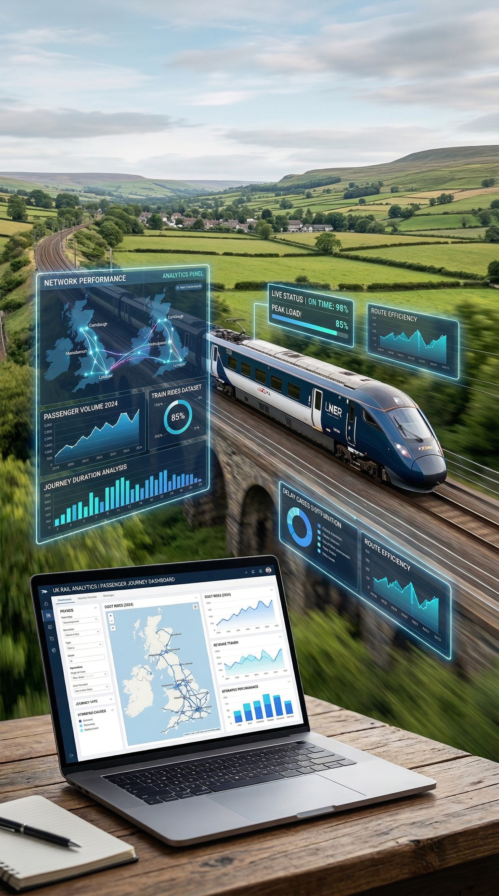

# 🚆 UK Train Rides Data Analysis

---

# 📊 Project Overview

The **UK Train Rides Analysis** project explores railway ticket transactions across the United Kingdom.  
The goal of this analysis is to understand **passenger behavior, ticket purchasing patterns, journey delays, and refund requests**.

The dataset contains **31,653 train ticket transactions** with detailed information about journeys, ticket types, payments, and delay reasons.

This project demonstrates skills in:

- Data Cleaning
- Exploratory Data Analysis (EDA)
- Data Visualization
- Dashboard Development

---

# 📂 Project Files

You can find the full project files here:

🔗 https://drive.google.com/drive/folders/1jviADDHE7zOon8ig8M8K1t1dOOIXSyoE?usp=sharing

---

# 👥 Team

| Name | Role |
|-----|-----|
| Mohamed Omar | Data Analysis |
| Kerols Raafat | Data Analysis |
| Joseph Milad | Data Analysis |
| Yahya Ebrahim | Data Analysis |
| Ahmed Reda | Data Analysis |
| Ahmed Elsayed | Data Analysis |
| Dina Ezzat | Instructor |

---

# 📂 Dataset Description

The dataset contains **18 columns** describing train ticket purchases and journey information.

### Key Variables

| Column | Description |
|------|-------------|
| Transaction ID | Unique ticket transaction identifier |
| Date of Purchase | Date when the ticket was purchased |
| Time of Purchase | Time of purchase |
| Purchase Type | Online or Station purchase |
| Payment Method | Payment type used |
| Railcard | Rail discount card |
| Ticket Class | Standard or First Class |
| Ticket Type | Single or Return |
| Price | Ticket price |
| Departure Station | Starting station |
| Arrival Destination | Destination station |
| Date of Journey | Date of travel |
| Departure Time | Scheduled departure |
| Arrival Time | Scheduled arrival |
| Actual Arrival Time | Real arrival time |
| Journey Status | On Time, Delayed, Cancelled |
| Reason for Delay | Cause of delay |
| Refund Request | Whether a refund was requested |

---

# 🛠 Tools Used

- Python  
- Pandas  
- NumPy  
- Matplotlib  
- Seaborn  
- Jupyter Notebook  
- Power BI / Excel  

---

# 🔎 Data Analysis Steps

1️⃣ Data Loading  

2️⃣ Data Cleaning  

3️⃣ Handling Missing Values  

4️⃣ Removing Duplicates  

5️⃣ Exploratory Data Analysis (EDA)  

6️⃣ Data Visualization  

7️⃣ Dashboard Creation  

---

# 📈 Key Performance Indicators (KPIs)

The analysis focuses on the following metrics:

- 🎫 Total Ticket Sales  
- 💰 Average Ticket Price  
- 🚆 Most Popular Routes  
- ⏱ Delayed Journeys  
- 🔁 Refund Request Rate  
- 🎟 Ticket Class Distribution  

---

# 📊 Example Analysis Questions

This project answers several important questions:

- Which **stations have the highest passenger traffic**?
- What are the most common **ticket types purchased**?
- Which **payment methods** are most used?
- What percentage of journeys are **delayed**?
- What are the **main reasons for train delays**?
- How often do passengers **request refunds**?

---

# 📊 Dashboard

The dashboard visualizes key insights such as:

- Ticket sales distribution
- Journey status breakdown
- Delay reasons
- Most popular routes
- Ticket class analysis

---

# 🚀 How to Run the Project

Clone the repository:
